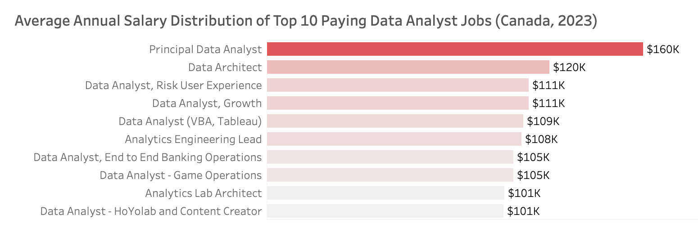
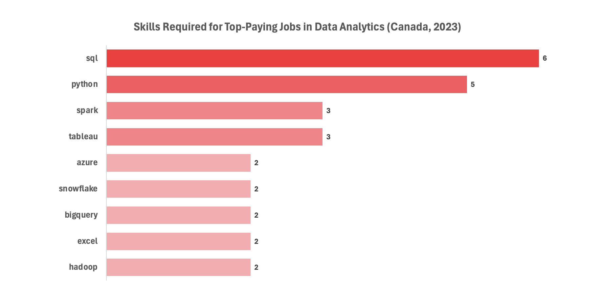
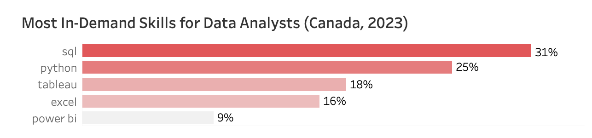
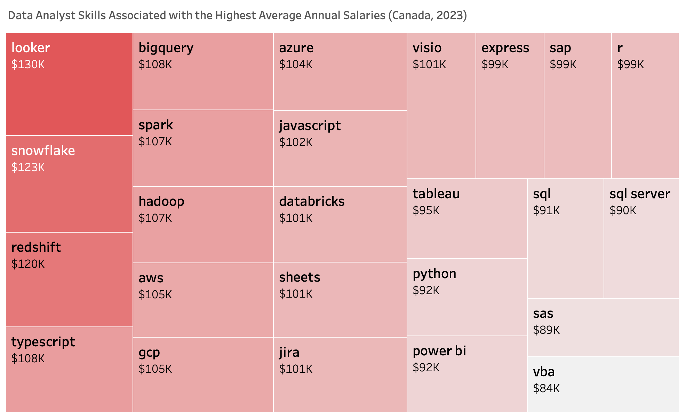
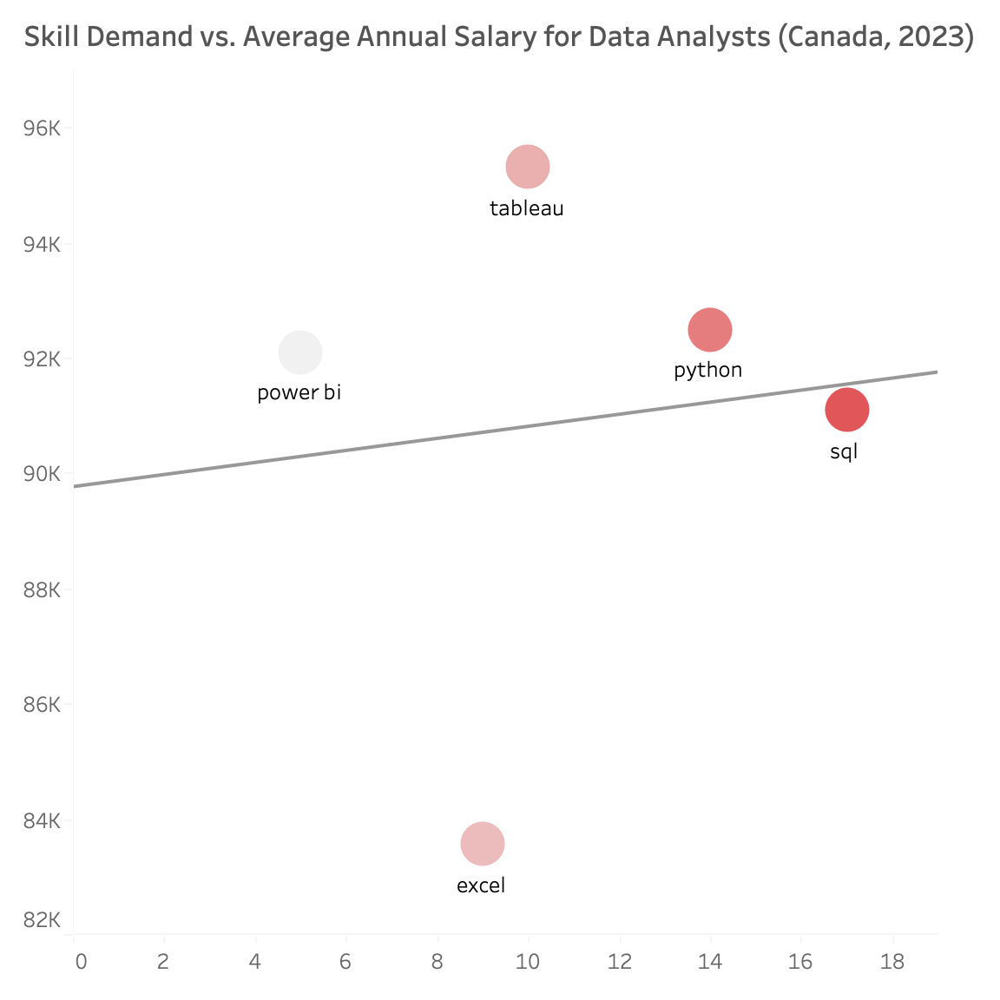
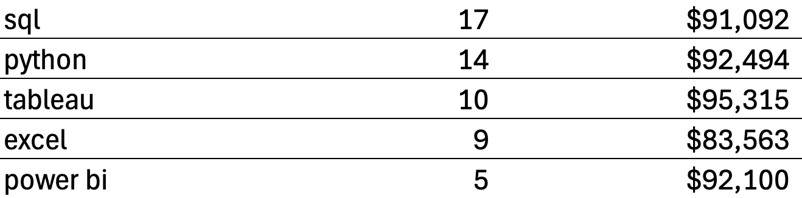

 # Introduction
What skills are most valuable for aspiring Data Analysts? This project uses SQL to explore the Canadian Data Analyst job market, analyzing salary trends, in-demand skills, and where high demand meets high earning potential.

  Check out my SQL queries here: [project_sql folder](/project_sql/)

  <br>

 # Background
  Driven by a desire to navigate the data analyst job market more effectively, this project started from wanting to pinpoint top-paid and in-demand skills.
  All data comes from [Data Nerds SQL Course](https://www.youtube.com/@LukeBarousse), with insights on job titles, salaries, locations and essential skills.

  ### Questions I wanted to answer through my SQL queries:
  1. What are the top-paying Data Analyst jobs?
  2. What skills are required for these top-paying jobs?
  3. What skills are most in-demand for Data Analysts overall?
  4. What skills are associated with higher salaries for Data Analysts?
  5. What are the most optimal skills to learn? (Optimal = high demand AND high paying)

  <br>

 # Tools I Used
  - **SQL:** the backbone of my analysis, allowing me to query the database and find critical insights

  - **PostgreSQL:** the chosen database management system

  - **Visual Studio Code:** database management and executing SQL queries

  - **Git & GitHub:** essential for version control and sharing my SQL syntax and analysis, ensuring project tracking

  <br>

 # The Analysis
  Each query for this project aimed to investigate specific aspects of the data analyst job market.
  Here's how I approached each question:

  ### 1. Top Paying Data Analyst Jobs 
  I identified the highest-paying roles, I filtered data analyst poistions by average yearly salary and location, focusing on jobs based in Canada. 
  
  This query highlights the high-paying opportunities in the field of Data Analytics:
 
```sql

  SELECT
    jf.job_id,
    jf.job_title,
    jf.job_title_short,
    cd.name AS company_name,
    jf.job_location,
    jf.job_country,
    jf.salary_year_avg
  FROM
      job_postings_fact jf
  LEFT JOIN
      company_dim cd USING (company_id)
  WHERE
      job_country = 'Canada' 
      AND job_title_short = 'Data Analyst' 
      AND salary_year_avg IS NOT NULL
  ORDER BY
      salary_year_avg DESC
  LIMIT 10;

```

#### Here is a breakdown of the high paying Data Analyst jobs in Canada in 2023:

- **Role Diversity:** Job titles extend beyond "Data Analyst," with high-paying roles including Principal Data Analyst, Data Architect, Analytics Engineering Lead, and specialized analyst positions in Growth, Risk, Banking, and Game Operations.

- **Salary Range:** Top salaries range from approximately **$100K to $160K CAD**, with the highest-paying role earning $160K, demonstrating strong earning potential for experienced and specialized analytics professionals.

- **Leading Employers:** High-paying opportunities span both technology and enterprise organizations, with companies including Stripe, Swiss Re, Sun Life, ATB Financial, and HoYoverse, indicating strong demand for analytics talent across diverse industries.

<br>


*Bar chart visualizing the average annual salaries of the top 10 highest-paying Data Analyst positions in Canada. Based on SQL query results, visualized in Tableau.*

<br>

  ### 2. Skills Required for these Top-Paying Jobs  

I identified the skills required for each of these top-paying jobs. First, I created a temporary result set using a CTE that contained the top-paying Data Analyst jobs in Canada. I then queried this result set, joining it with the skills table to identify the skills required for each role.

This query highlight all skills listed for these top-pay Data Analyst jobs:

```sql

    -- CTE for top-paying jobs

    WITH top_paying_jobs AS ( 
        SELECT
            job_id,
            job_title,
            job_title_short,
            name AS company_name,
            job_location,
            job_country,
            salary_year_avg
        FROM
            job_postings_fact
        LEFT JOIN company_dim USING (company_id)
        WHERE
            job_country = 'Canada' 
            AND job_title_short = 'Data Analyst'
            AND salary_year_avg IS NOT NULL
        ORDER BY
            salary_year_avg DESC
        LIMIT 10
    )

    -- main query

    SELECT
        tpj.*,
        sd.skills
    FROM
        top_paying_jobs tpj
    INNER JOIN skills_job_dim sjd ON tpj.job_id = sjd.job_id
    INNER JOIN skills_dim sd ON sjd.skill_id = sd.skill_id
    ORDER BY
        tpj.salary_year_avg DESC;

```

#### Here is a breakdown of the skills required for these top-paying Data Analyst jobs in Canada in 2023:

- **SQL and Python** are the most in-demand skills, appearing in the majority of top-paying Data Analyst job postings, reinforcing their importance as core technical competencies.

- **Cloud and big data technologies** are common, with tools like Snowflake, BigQuery, Azure, and Hadoop frequently requested, reflecting the shift toward modern data platforms.

- **Visualization remains a key requirement**, with Tableau leading BI tools, highlighting the value employers place on translating data into actionable business insights.

<br>


*Bar chart visualizing the top technical skills required for the top-paying Data Analyst positions in Canada. Based on SQL query results, visualized in Tableau.*

<br>

  ### 3. Most In-Demand Skills for Data Analysts   

  I identified the technical skills most frequently requested across all Data Analyst job postings. I counted the frequency of each skill, joined the relevant tables to retrieve the skill names, filtered for Canadian Data Analyst positions, and returned the top five most requested skills.

  The two queries below produce the same results using different SQL approaches. The first uses multiple joins, while the second uses a CTE. Both identify the most in-demand technical skills for Data Analysts based on the frequency each skill appears in job postings:

```sql

    -- using multiple joins

    SELECT
    sd.skills,
    COUNT(*) AS demand_count
    FROM
        job_postings_fact jpf
    INNER JOIN skills_job_dim sjd ON jpf.job_id = sjd.job_id
    INNER JOIN skills_dim sd ON sjd.skill_id = sd.skill_id
    WHERE
        job_title_short = 'Data Analyst' AND
        job_country = 'Canada'
    GROUP BY
        sd.skills
    ORDER BY
        demand_count DESC
    LIMIT 5;

```
<br>

```sql

    -- CTE to find top 5 skills for data analysts in Canada

    WITH top_five_skills AS (
        SELECT
            skill_id,
            COUNT(*) AS skill_count
        FROM
            skills_job_dim sjd
        LEFT JOIN
            job_postings_fact USING (job_id)
        WHERE
            job_title_short = 'Data Analyst' AND
            job_country = 'Canada'
        GROUP BY
            skill_id
        ORDER BY
            skill_count DESC
        LIMIT 5
    )

    -- main query to add skill name

    SELECT
        sd.skills AS Skill,
        tfs.skill_count
    FROM
        top_five_skills tfs
    LEFT JOIN
        skills_dim sd USING (skill_id)
    ORDER BY
        skill_count DESC;

```
#### Here is a breakdown of the most in-demand skills for Data Analyst in Canada in 2023:

- **SQL** emerged as the most in-demand skill, appearing in **1,247** job postings. It represented **31%** of the total mentions across the top five most-requested skills.

- **Programming and visualization tools** remain highly valued, with **Python** represnting **25%** of the total mentions (761 job postings), and **Tableau** at **18%** (592 job postings).

- The results suggest employers prioritize a combination of database querying, spreadsheet analysis, programming, and data visualization skills, highlighting the importance of a well-rounded technical skill set.

<br>


*Bar chart visualizing the most in-demand technical skills for Data Analysts in Canada, based on the frequency each skill appears in 2023 job postings. Based on SQL query results, visualized in Tableau.*

<br>

  ### 4. Top Skills based on Salary for Data Analysts

I analyzed the average annual salary associated with each skill by joining multiple tables to retrieve skill names and filtering for Canadian Data Analyst positions. I then limited the results to the top 25 skills by highest average salary.

This query highlights top skills for Data Analysts based on average annual salary:

```sql

    SELECT
    sd.skills,
    ROUND(AVG(salary_year_avg), 0) AS average_salary
    FROM
        job_postings_fact jpf
    INNER JOIN skills_job_dim sjd ON jpf.job_id = sjd.job_id
    INNER JOIN skills_dim sd ON sjd.skill_id = sd.skill_id
    WHERE
        job_title_short = 'Data Analyst' 
        AND salary_year_avg IS NOT NULL
        AND job_country = 'Canada'
    GROUP BY
        sd.skills
    ORDER BY
        average_salary DESC
    LIMIT 25;

```
#### Here is a breakdown of the top 25 Data Analyst skills associated with the highest average annual salaries in Canada in 2023:

- **Cloud data platforms** lead salary rankings, with Snowflake, BigQuery, 
Redshift, AWS, Azure, and Databricks reflecting strong demand for modern 
data infrastructure skills.

- **Business Intelligence and programming skills** remain highly valued, with Looker, Tableau, Python, and R associated with above-average salaries.

- The highest-paying Data Analyst roles extend beyond traditional analytics, 
favouring professionals with a blend of **cloud, visualization, programming, and big data expertise.**

<br>


*Treemap visualizing the top 25 highest-paying skills for Data Analysts in Canada, based on average annual salaries from 2023 job postings. Based on SQL query results, visualized in Tableau.*

<br>

  ### 5. Optimal Skills to Learn

  I combined the results of the previous two analyses to identify the most valuable skills to learn by comparing skill demand with average annual salary. I calculated skill demand and average salary for each skill, joined the relevant tables to retrieve skill names, and filtered for Canadian Data Analyst job postings with more than five occurrences.

This query highlights the most valuable skills for Data Analysts by combining skill demand with average annual salary:

```sql

    SELECT
        sd.skill_id,
        sd.skills,
        COUNT(sjd.skill_id) AS demand_count,
        ROUND(AVG(jpf.salary_year_avg), 0) AS average_salary
    FROM
        job_postings_fact jpf 
    INNER JOIN skills_job_dim sjd ON jpf.job_id = sjd.job_id
    INNER JOIN skills_dim sd ON sjd.skill_id = sd.skill_id
    WHERE
        job_title_short = 'Data Analyst'
        AND job_country = 'Canada'
        AND salary_year_avg IS NOT NULL
    GROUP BY
        sd.skill_id
    HAVING
        COUNT(sjd.skill_id) >= 5
    ORDER BY -- will run first listed
        average_salary DESC,
        demand_count DESC
    LIMIT 25;

```

#### Here is a breakdown of the most valuable skills to learn for career development in Data Analytics:

- **SQL** is the most valuable skill for aspiring Data Analysts, combining the highest demand **(17 job postings)** with a strong average annual salary **($91K)**, making it the best overall skill to prioritize.

- **Tableau** is another high-value skill, offering the highest average annual salary **($95K)** while maintaining strong demand **(10 job postings)**, demonstrating the value of data visualization expertise.

- The most optimal skills balance demand and salary. While higher demand didn't always translate to higher pay, skills like **SQL, Tableau**, and **Python** provide the strongest combination of market demand and earning potential.

<br>


*Scatterplot with a trend line visualizing the correlation between skill demand and average annual salaries for Data Analysts in Canada, based on 2023 job postings. Based on SQL query results, visualized in Tableau.*

<br>


*SQL query results listing Data Analyst skills by demand count, with corresponding average annual salary.*

<br>

# What I Learned

- **Database Management:** Created a relational SQL database by defining tables, importing data, and establishing relationships to support complex SQL queries.

- **Advanced SQL:** Wrote complex SQL queries using JOINs, Common Table Expressions (CTEs), aggregate functions, and filtering techniques to extract meaningful insights from relational databases.

- **Data Visualization:** Designed clear, insight-driven visualizations including bar charts, treemaps, and scatterplots to communicate trends, comparisons, and relationships in the data.

- **Data Storytelling:** Connected analysis with objectives by transforming SQL query results into clear, data-driven recommendations and strategic insights.

<br>

# Conclusions

This analysis explored the Canadian Data Analyst job market by examining salary trends, in-demand skills, and the relationship between skill demand and earning potential.

From the analysis, several general insights emerged:

1. **Top Ranking Data Analyst Jobs:** 
The highest paying jobs for Data Analysts in Canada offer a salary range between **$100K** and **$160K**.

2. **Skills Required for these Top Ranking Jobs:**
High-paying Data Analyst roles consistently require advanced proficiency in **SQL (22% occurrence)** and **Python (19% occurrence)**, making them the most critical technical skills for securing top-paying positions.

3. **Most In-Demand Skills for Data Analysts:**
**SQL** is the most in-demand skill in the Data Analyst job market, making it essential for job seekers, with **31%** of the total job posting mentions.

4. **Skills Associated with High Salary Jobs:**
Specialized skills, such as **Looker**, **Snowflake** and **RedShift**, are associated with the highest average annual salaries, indicating a niche expertise.

5. **Optimal Skills to Learn for Data Analysts: SQL** leads in demand and offers a high average salary, positioning it as one of the most optimal skills for Data Analysts to learn to maximize their market value.

<br>

This analysis highlights that success as a Data Analyst depends on developing a well-rounded technical skill set, with **SQL emerging as the strongest overall skill** due to its combination of high demand and competitive earning potential. Together with Python and Tableau, these skills provide the greatest market value for aspiring Data Analysts looking to maximize both employability and long-term salary potential.

<br>
